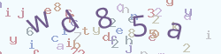

# webman captcha plugin

[](https://packagist.org/packages/tinywan/captcha) [](https://packagist.org/packages/tinywan/captcha) [](https://packagist.org/packages/tinywan/captcha) [](https://packagist.org/packages/tinywan/captcha)

base64 image verification captcha library for webman plugin

## 安装

```shell
composer require tinywan/captcha
```

## 使用

### 1、生成base64

```php
var_export(Tinywan\Captcha\Captcha::base64());  // 就这么简单
```

**以上输出base64**
```php
array (
  'key' => '$2y$10$QCLukWC.DMmPuMArKEJNaeBaSeBnzFOM3nv8bL4jBJFJBIe.8YngC',
  'base64' => 'data:image/png;base64,iVBORw0KGgoAAAANSUhEUgAAAPoAAAA+BAMAAADwuxusAAAAG1BMVEXz+/5Bd1vc6umauaxtmIODqJiwycBXh2/G2tUJ+xU0AAAACXBIWXMAAA7EAAAOxAGVKw4bAAACo0lEQVRYhe1Xz7OTMBCmSaE5uj76eEfQ6dRjcUbH44tv/HFs1T8AxovHph70WMbq8882hBKSQKXEPrnkO0CSDfl2s5vd4HkODg4ODg4ODg6ngF6NyZ7fjMmePh6TfTMOO6Frwf7IHH//EGxMGIkhO/YRuy5fdGvMsw6EJ38TpoJsBnKgiOJSqdvLsD+lED4/LU5CQTmXAxhuO9mvbcgxlPigD/6OZXMKZXujWEav+APWxjqFDTviln/8BNKt1SBEcjcCWPEnU9y8hD2fsZJ9srJmX8I89rwFzNVBBIo6JTFRyHhny2c06m6Eb5IrC3bKDeG4F85s6H826pQn2xfbXyOdcw0a9qXwgg07hqNDaagLFtKxBV92okmnkJFK6UpVVhJPtN07D0ltw1Td2xIyzmaRGdCI7QJ1M4ryWxt2Wn+DmJE6Z7W5mJtJ9cxWhAEoXQJcudlwdgK7unnY6yK/Xh/BGhnny4fPKjs3Pmu0PR++ud+qKD626DZQvFwNfY3ULuHRMx3OPtNi2RDVrfxmGhnCBHSuHPYW7BOxLN53iHK52mTeOk2Bnh94f+ebGvYjEYvkHUc1AJlb/ShvFfONEWNptLBmh9emAG2aiCDQKimt3ILhbjh7lUV4rs907h8UlBPODLHXkdXTCMw5vagKGNe8CZlnv16842k+jJWV2wu3qrkPw9nxcX9l0sFMFNzoLj75TaVQOxLeDmb3mLAhgLqA5gDf3rz80sPdcbHyyHByLxfXpERmk/t2AHaBtC4XVsDw3TveVgQQFer0IT+dpQYh5Z7HSnH3of+OgugZk84CYVFWqJakp1O/BIT7y7Dza0TEVEsI60/YyqXzX3EA/Va1bKru/8DBCDRq1tOHhfEvgy8VU3YY998cZWOyOzg4ONjjD4tjUV+t8cERAAAAAElFTkSuQmCC',
)
```
> 通过网址：https://tool.jisuapi.com/base642pic.html BASE64转图片

**转图片效果如图**



### 2、验证验证码

```php
use Tinywan\Captcha\Captcha;
use support\Request;

$code = $request->get('code');
$key = $request->get('key');
if (false === Tinywan\Captcha\Captcha::check($code, $key)) {
	// 验证失败
};
// 验证通过
```
